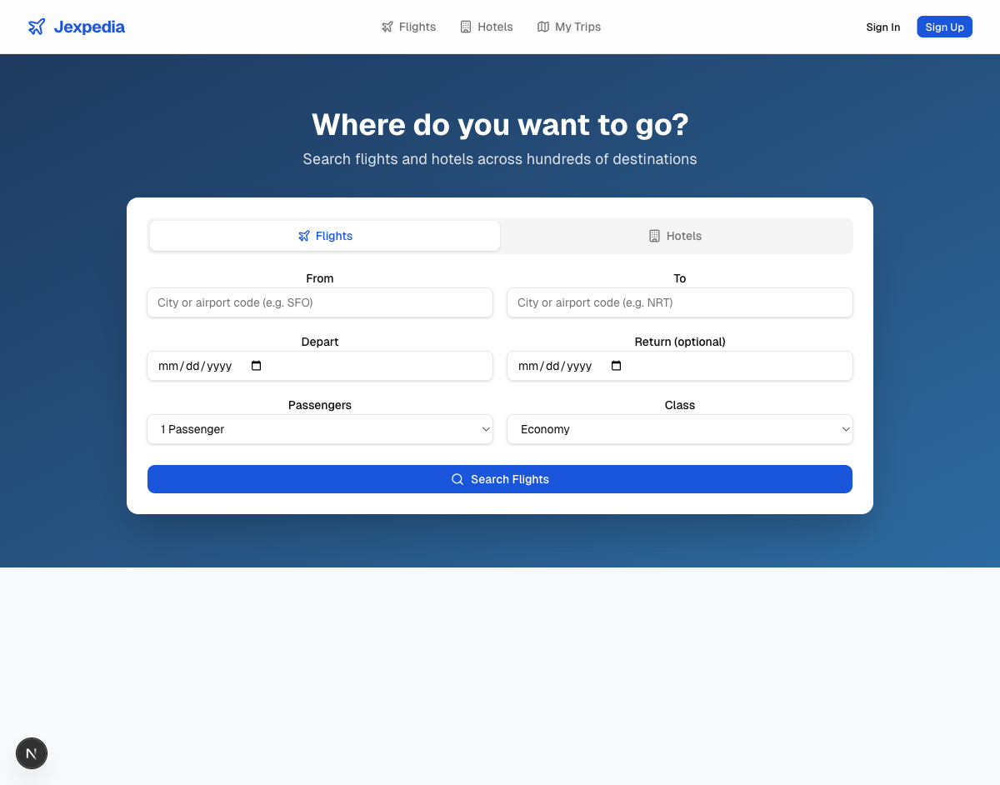
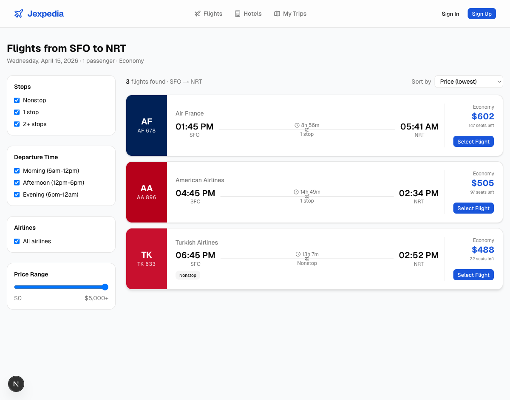
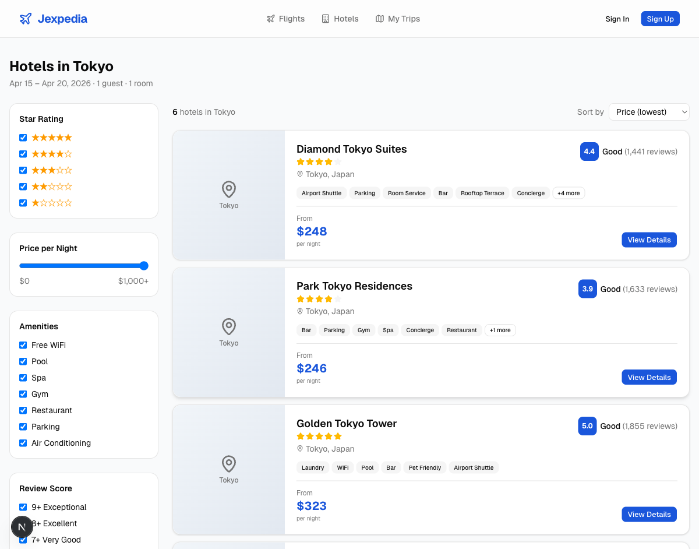
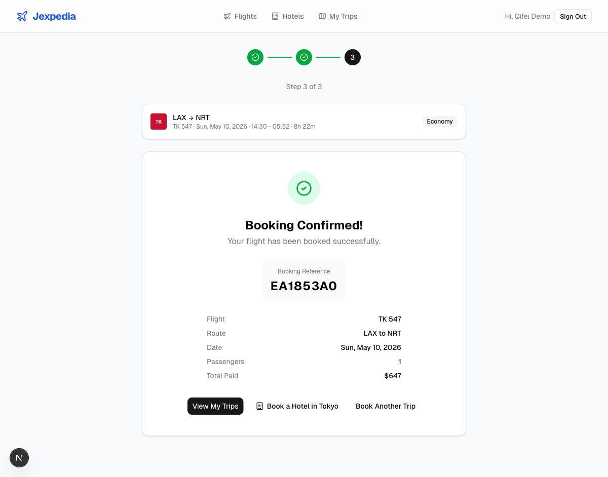
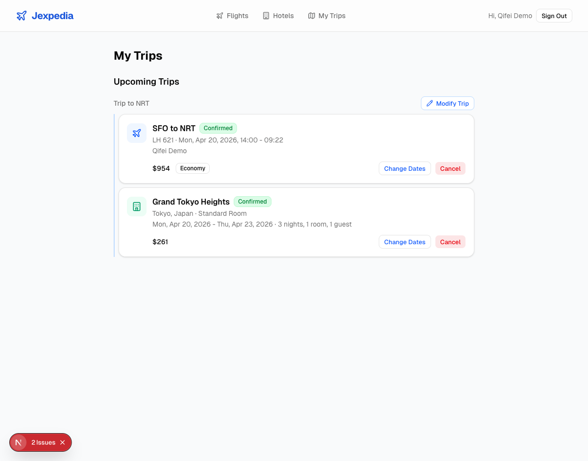
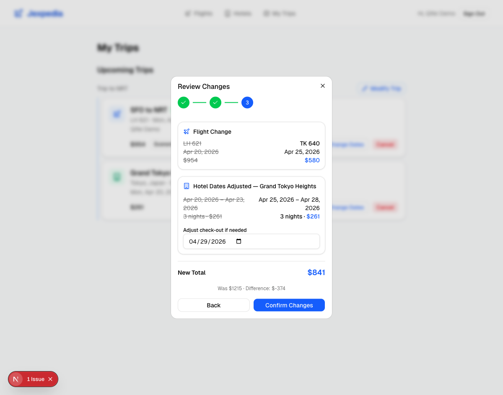
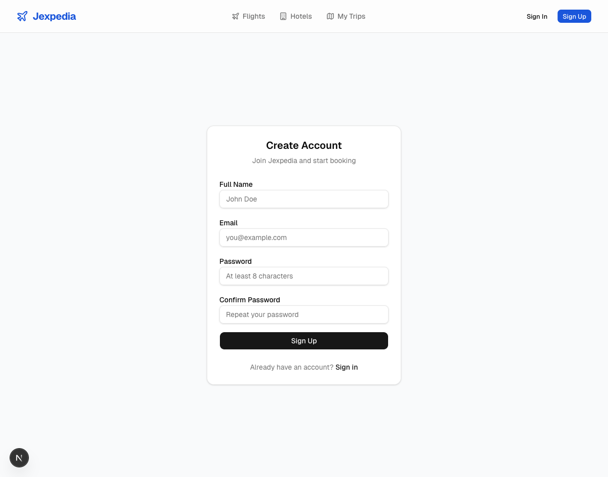
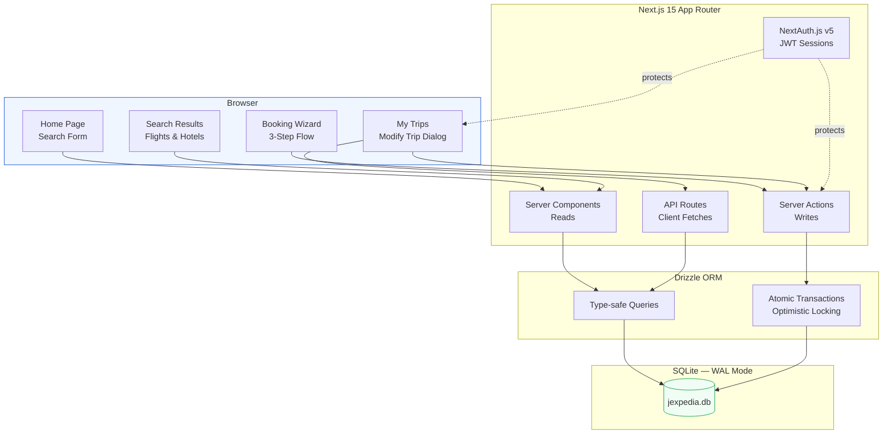
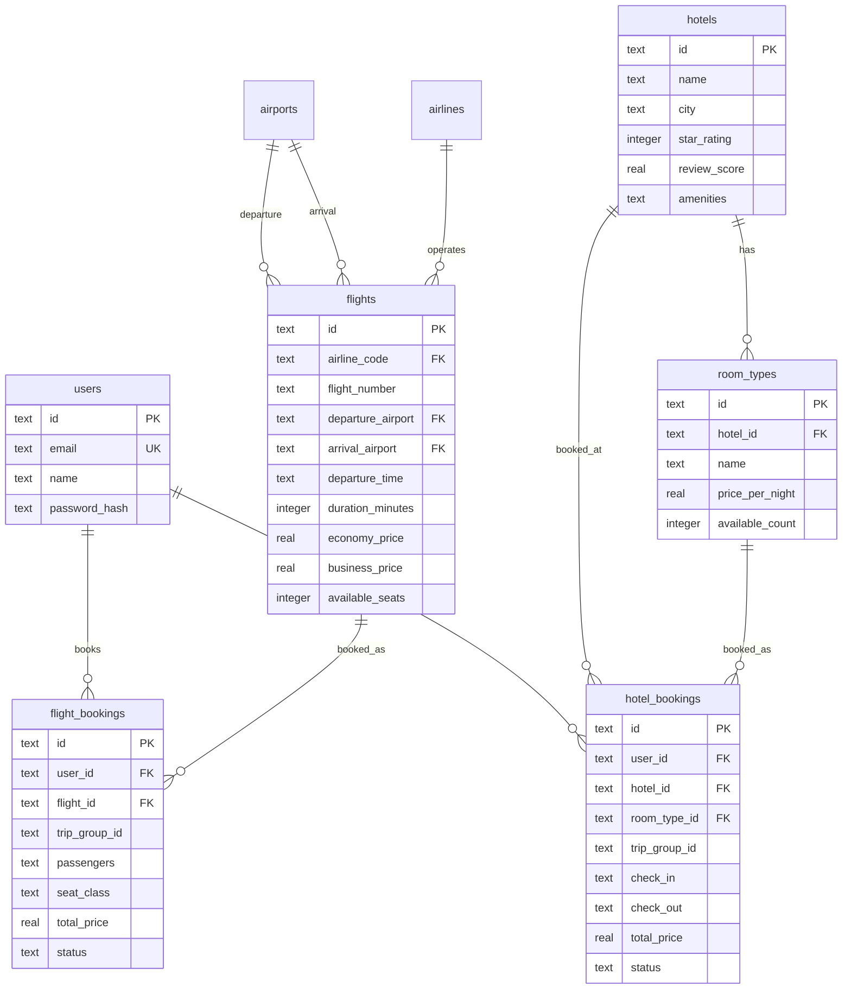
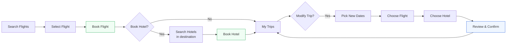

# Jexpedia

A full-stack travel booking platform built with Next.js 15, featuring end-to-end trip management for flights and hotels.



## Features

### Flight Search & Booking

Search flights by route and date with real-time results. Filter by stops, departure time, airlines, and price range. Select economy or business class with per-passenger pricing.



### Hotel Search & Booking

Search hotels by city with star ratings, review scores, amenities, and room type selection. Multiple room types per hotel (Standard, Deluxe, Suite) with availability tracking.



### Connected Trip Flow

After booking a flight, the confirmation page offers **"Book a Hotel in {city}"** with the destination city and dates pre-filled. Flight and hotel bookings are linked together as a trip.



### Trip Management

View all bookings in **My Trips** with upcoming and past sections. Linked flight + hotel bookings display as grouped trips.



### Modify Trip

Change your entire trip in one flow. Pick new dates, select a replacement flight, choose a new hotel, and review all changes side-by-side with price comparison before confirming. Both bookings update atomically.



### User Authentication

Sign up and sign in with email and password. Session-based auth protects booking and trip management pages.



## Tech Stack

| Layer | Technology |
|-------|-----------|
| Framework | Next.js 15 (App Router) |
| Database | SQLite (better-sqlite3, WAL mode) |
| ORM | Drizzle ORM |
| Auth | NextAuth.js v5 |
| UI | shadcn/ui + Tailwind CSS v4 |
| Language | TypeScript |

## Getting Started

### Prerequisites

- Node.js 20+
- npm

### Install

```bash
git clone <repo-url>
cd jexpedia
npm install
```

### Seed the Database

```bash
npm run seed
```

This creates `data/jexpedia.db` with:
- 50 airports worldwide
- 15 airlines
- ~9,500 flights across 50+ routes (next 90 days)
- ~200 hotels across 25 cities with 2-3 room types each

User accounts are preserved across re-seeds. Use `npm run seed -- --force` to re-seed travel data (clears bookings but keeps users).

### Run

```bash
npm run dev
```

Open [http://localhost:3000](http://localhost:3000).

### Build

```bash
npm run build
npm start
```

## Architecture

### System Overview



### Data Model



### User Flow



### Key Design Decisions

- **SQLite** — zero-config embedded database, WAL mode for concurrent reads, sufficient for 100 users
- **Server Components** for reads, **Server Actions** for writes — no separate API layer needed
- **Optimistic locking** on bookings — `UPDATE ... WHERE available >= N` prevents overbooking
- **tripGroupId** — UUID linking flight + hotel bookings as a single trip for grouped display and atomic modification
- **URL-driven filters** — search params in the URL for shareable, bookmarkable searches

## Project Structure

```
src/
├── app/                          # Next.js App Router pages
│   ├── page.tsx                  # Home (search form)
│   ├── flights/                  # Flight search + detail
│   ├── hotels/                   # Hotel search + detail
│   ├── booking/                  # Flight + hotel booking wizards
│   ├── my-trips/                 # Trip management + modification
│   ├── auth/                     # Sign in + sign up
│   └── api/                      # API routes (airports, flights, hotels)
├── components/                   # Shared UI components
│   ├── navbar.tsx                # Top navigation
│   ├── search-form.tsx           # Hero search with tabs
│   ├── flight-card.tsx           # Flight result card
│   ├── hotel-card.tsx            # Hotel result card
│   └── ui/                      # shadcn/ui components
├── db/
│   ├── schema.ts                 # Drizzle schema (8 tables)
│   ├── index.ts                  # DB connection (WAL mode)
│   └── seed.ts                   # Data seeder
├── lib/
│   ├── actions/                  # Server Actions (booking, auth)
│   └── queries/                  # Drizzle queries (flights, hotels)
└── auth.ts                       # NextAuth configuration
```

## Key Workflows

### Book a Trip
1. Search flights (home page)
2. Select a flight, choose class
3. Fill passenger info, review, pay (simulated)
4. Click "Book a Hotel in {city}" on confirmation
5. Select hotel, pick room type
6. Fill guest info, review, pay
7. View grouped trip in My Trips

### Modify a Trip
1. Go to My Trips
2. Click "Modify Trip" on a grouped trip
3. Pick new departure + return dates
4. Select a new flight from results
5. Select a new hotel + room from results
6. Review old vs new (with price comparison)
7. Confirm — both update atomically

## Environment Variables

Create `.env.local`:

```
AUTH_SECRET=your-secret-here
AUTH_TRUST_HOST=true
```

## Deployment

SQLite requires a persistent filesystem. Compatible with:
- Docker
- Fly.io
- Railway
- Any VM/VPS

Not compatible with serverless platforms (Vercel, Netlify) without switching to a hosted DB like Turso.

## License

MIT
