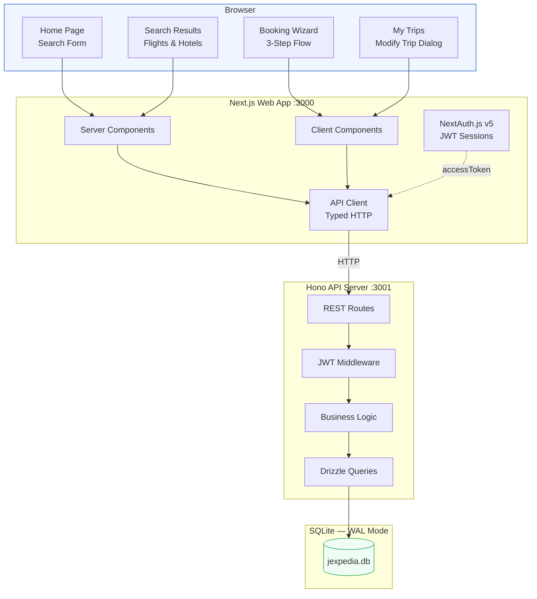
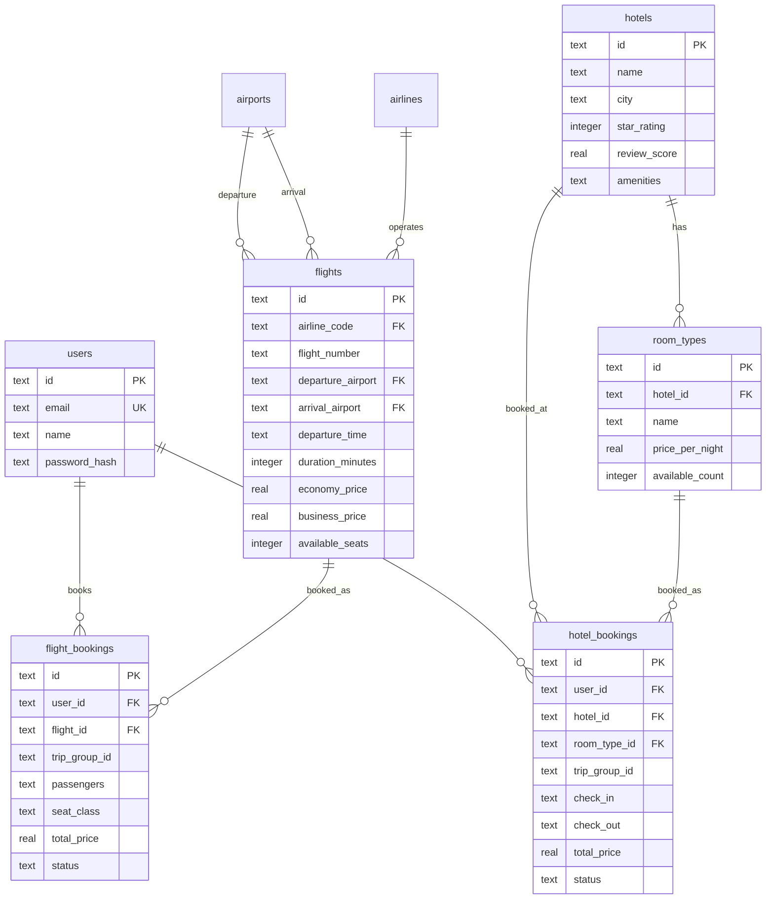
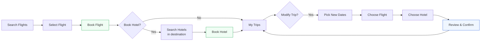

# Jexpedia

A travel booking platform with a separated API service and web frontend, built as an npm workspaces monorepo.


## Architecture

```
jexpedia/
├── apps/
│   ├── api/                    # Hono REST API — owns all data
│   │   ├── src/
│   │   │   ├── routes/         # REST endpoint handlers
│   │   │   ├── services/       # Business logic (booking, auth, trips)
│   │   │   ├── queries/        # Drizzle query functions
│   │   │   ├── db/             # SQLite connection + schema + seed
│   │   │   ├── middleware/     # JWT auth middleware
│   │   │   └── index.ts        # Hono server entry (port 3001)
│   │   └── package.json
│   └── web/                    # Next.js frontend — NO database access
│       ├── src/
│       │   ├── app/            # Pages, layouts (same UI)
│       │   ├── components/     # UI components (navbar, cards, etc.)
│       │   ├── lib/
│       │   │   ├── api-client.ts   # Typed HTTP client for the API
│       │   │   └── use-api.ts      # React hook for client components
│       │   └── auth.ts         # NextAuth config (calls API for auth)
│       ├── next.config.ts
│       └── package.json
├── packages/
│   └── shared/                 # Shared TypeScript types
│       └── src/types.ts
├── data/                       # SQLite database (shared location)
└── package.json                # npm workspaces root
```

## Features

### Flight Search & Booking

Search flights by route and date with real-time results. Filter by stops, departure time, airlines, and price range. Select economy or business class with per-passenger pricing.


### Hotel Search & Booking

Search hotels by city with star ratings, review scores, amenities, and room type selection. Multiple room types per hotel (Standard, Deluxe, Suite) with availability tracking.


### Connected Trip Flow

After booking a flight, the confirmation page offers **"Book a Hotel in {city}"** with the destination city and dates pre-filled. Flight and hotel bookings are linked together as a trip.


### Trip Management

View all bookings in **My Trips** with upcoming and past sections. Linked flight + hotel bookings display as grouped trips.


### Modify Trip

Change your entire trip in one flow. Pick new dates, select a replacement flight, choose a new hotel, and review all changes side-by-side with price comparison before confirming. Both bookings update atomically.


### User Authentication

Sign up and sign in with email and password. JWT-based auth protects booking and trip management endpoints.


## Tech Stack

| Layer | Technology |
|-------|-----------|
| API Server | Hono (TypeScript, ~14KB) |
| Frontend | Next.js 16 (App Router) |
| Database | SQLite (better-sqlite3, WAL mode) |
| ORM | Drizzle ORM |
| Auth | JWT (API) + NextAuth.js v5 (web) |
| UI | shadcn/ui + Tailwind CSS v4 |
| Language | TypeScript |

## Getting Started

### Prerequisites

- Node.js 20+
- npm

### Install

```bash
git clone <repo-url>
cd jexpedia
npm install
```

### Seed the Database

```bash
npm run seed
```

This creates `data/jexpedia.db` with:
- 50 airports worldwide
- 15 airlines
- ~9,500 flights across 50+ routes (next 90 days)
- ~200 hotels across 25 cities with 2-3 room types each

User accounts are preserved across re-seeds. Use `npm run seed -- --force` to re-seed travel data (clears bookings but keeps users).

### Run

```bash
npm run dev
```

This starts both servers concurrently:
- **API server**: [http://localhost:3001](http://localhost:3001)
- **Web app**: [http://localhost:3000](http://localhost:3000)

You can also run them individually:

```bash
npm run dev:api      # API server only (port 3001)
npm run dev:web      # Next.js only (port 3000)
```

### Build

```bash
npm run build        # builds the Next.js web app
npm start            # starts the production web server
```

Note: The API server must be running separately in production.

## API Endpoints

| Method | Path | Auth | Description |
|--------|------|------|-------------|
| GET | /api/flights/search | No | Search flights by route + date |
| GET | /api/flights/:id | No | Get flight details |
| GET | /api/hotels/search | No | Search hotels by city |
| GET | /api/hotels/:id | No | Get hotel details |
| GET | /api/airports/:code | No | Airport lookup |
| GET | /api/airports/search | No | Airport fuzzy search |
| POST | /api/auth/signup | No | Create account, return JWT |
| POST | /api/auth/signin | No | Validate credentials, return JWT |
| POST | /api/bookings/flight | JWT | Book a flight |
| POST | /api/bookings/hotel | JWT | Book a hotel |
| POST | /api/bookings/:id/cancel | JWT | Cancel a booking |
| GET | /api/trips | JWT | Get user's bookings (grouped) |
| POST | /api/trips/modify | JWT | Modify trip (flight + hotel) |
| POST | /api/bookings/flight/modify | JWT | Modify flight dates only |
| POST | /api/bookings/hotel/modify | JWT | Modify hotel dates only |

## System Overview



## Data Model



## User Flow



## Auth Architecture

1. **API server** issues JWTs signed with `AUTH_SECRET` via `jsonwebtoken`
2. **Web app** uses NextAuth.js v5 — its `authorize` function calls `POST /api/auth/signin`
3. NextAuth JWT callback stores the API token as `accessToken`
4. Server Components read `session.accessToken` and pass to the API client
5. Client Components get the token via `AuthProvider` React context + `useApi()` hook

## Key Design Decisions

- **Monorepo with npm workspaces** — shared types, single `npm install`, independent scaling
- **Hono for the API** — TypeScript-first, Web Standard Request/Response, ~14KB, built-in CORS + JWT
- **SQLite** — zero-config embedded database, WAL mode for concurrent reads
- **Optimistic locking** on bookings — `UPDATE ... WHERE available >= N` prevents overbooking
- **tripGroupId** — UUID linking flight + hotel bookings as a single trip for grouped display and atomic modification
- **URL-driven filters** — search params in the URL for shareable, bookmarkable searches

## Environment Variables

### Web app (`apps/web/.env.local`)

```
AUTH_SECRET=your-secret-here
AUTH_TRUST_HOST=true
NEXT_PUBLIC_API_URL=http://localhost:3001
```

### API server

Uses `AUTH_SECRET` from environment (defaults to dev secret). Set `API_PORT` to change from default 3001.

## Deployment

The API server and web app can be deployed independently:

- **API server** — any Node.js host with persistent filesystem (for SQLite)
- **Web app** — any Node.js host, or Vercel/Netlify (no SQLite dependency)

Set `NEXT_PUBLIC_API_URL` on the web app to point to the deployed API server.

## License

MIT
